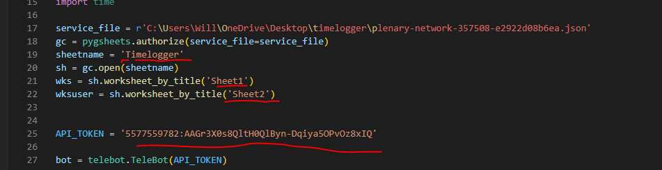

# TimeLogger
Time Logger in Telegram using python
### Features:
  - You can time in and time out using telegram bot

### Tech Stacks:
  - pyTelegramBotAPI==4.6.0 (for telegram bot)
  - pygsheets==2.0.5 (for gsheets)

## Prerequisites:

  - You should install the latest python version 
  - Import all modules required for the project using this command

```
pip install <module name>

```
## Procedures:

  -  Create a telegram bot @BotFather. It will help you to create and manage your bot. 
  -  Get the API token given by @BotFather and change the API token on my code.
  -  Go to Create Google cloud platform, enable the google drive API and google sheets API;
  -  Create first project then download the json file and copy the email. The copied email will be use to access the sheet.
  -  Here is the link on How to use Google sheets with python. https://www.youtube.com/watch?v=bu5wXjz2KvU
  -  Change the directory path and name with your downloaded json file
  -  Change the sheet name and worksheet with your created sheet. Note: It has two worksheets; timelog records and user restriction
  -  
  -  Enjoy :)


